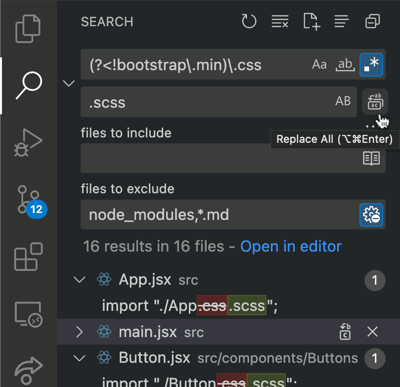
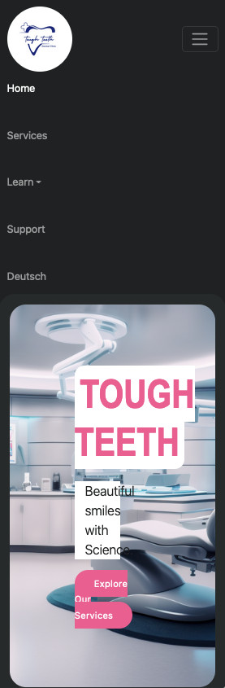

# The Bad News

## 1. Title
In `index.html`, you haven't given a suitable title to your site:
```html
  <title>Vite + React</title>
```

## 2. CSS or SASS?
I see that you have many `.css` files, one in each folder. But many of them are empty.

Since you are using Vite to build and serve your project, it is very easy to use SASS instead of CSS. In your Terminal, run...

`npm i -D sass`

... and then change the names of all your `.css` files to `.scss`.

> VS Code _should_ update all the links to your `.css` files inside your `.js` files, but it didn't do this for me. You can use the Search feature to find all references to `.css` in your project, and change them to `.scss`.

> Or not _quite_ all. You don't want to change the name of the `bootstrap.min.css` file. You can use this Regular Expression to find all occurrences of `.css` that _don't_ have `bootstrap.min` in front of them:
> 
> `(?<!bootstrap\.min)\.css`
>
> And if you see references to occurrences in files in the `node_modules` directory, or in this `feedback.md` file, you can tell VS Code not to look in those places.
> 
> 

## 3. Responsivity
Your site is responsive. You rely on Bootstrap for this. However, when the viewport is narrow, strange things happen:
* At width < 770px, the navbar becomes a hamburger menu (which is good), but the menu items appear to the left of the screen and the hamburger is on the right
* At width < 445px, the right side of even your smaller images gets cut off
* At width < 438px (but this might depend on the fonts installed on your end-user's device), the text inside your hero image starts to wrap, and the padding around it can look really weird.



It's good practice to create the CSS for the smallest screens, and to use @media queries to add more space or more elements for bigger sizes.

Here's a repo that demonstrates some CSS to alter the framing of an image as the width of the viewport changes.
https://github.com/FunForks/reformat-image

## 5. Faked Data

How many Michael Johnsons do you have working with you?


And unless you _really_ have someone called Johnson working for you, it's [a name that could lead to unexpected reactions](https://www.urbandictionary.com/define.php?term=johnson). The current [speaker of the House of Representatives in the USA](https://en.wikipedia.org/wiki/Mike_Johnson_(Louisiana_politician)) is called Michael Johnson, and [opinions about him are mixed](https://www.realclearpolitics.com/epolls/other/mike_johnson_favorableunfavorable-8301.html).

It might be better to choose a less controversial name :)

## 5. Copyright

**Copyright © 2053** ... you're a developer from the future! Can you tell us what the Interwebs will look like 19 years from now?

If you slap a Copyright notice on your page, and then use images for which **you do not own the copyright**, such as ...

* https://cliniify.com/blog/automated-healthcare-efficiency-with-a-deep-dive-into-AI-impact-on-clinic-management
* https://www.head45dental.co.uk/wp-content/uploads/2021/12/memes-dental-advertisement.webp
* https://www.instagram.com/dr_sadrajamali/p/CG5H5UkJgN-/
* https://www.talabudi.com/10598003/nina
* ...

... then you lose credibility. And possibly law suits.

If you don't have images to which you own the rights, you can search for images that have Creative Commons licences. For example:

https://openverse.org/search/?q=dentist%20smile&license_type=commercial,modification

Two warnings about this though:
1. You'll find the same images on plenty of other sites
2. You need to respect the licence of each image. This might mean including a credit for the author, with a link to their web site, or it may mean _not_ using an image for commercial purposes.

Sure, for now, since you are in an educational environment, and this is not a professional project, you can claim "fair use", and simply remove any images that any owner may complain about.

But don't claim copyright for something that isn't yours. It doesn't make you look good.

And anyway, the phrase is "All _rights_ reserved" (with an "s" at the end of "rights").

## 5. BrowserRouter

You are using BrowserRouter to manage routes in the browser. This is a good choice. However, it means that [you will not be able to use GitHub](https://www.freecodecamp.org/news/deploy-a-react-app-to-github-pages/#how-to-handle-routing-using-hashrouter) to host your site.

If you plan to use a different hosting service (like [Render.com](https://render.com/)), this won't be a problem. But "forewarned is forearmed".

## 6. Comments for Future You

I like to write detailed comments in my code to explain to my future self (or to my co-workers) why I chose to write my code the way I did. When I come back (maybe only three weeks later) I have often forgotten what the purpose of a particular variable is, or why I did things in a particular order.

The code you have written so far is quite simple. But it is going to get more complicated over time. Writing notes to yourself is a good way to revise the ideas that you have just learned.

It's good to start good habits early.

# The Good News

It's much easier to criticize than to praise. When you create a great project, people will say: "Yeah. It looks good. Now the next thing we need you to do is..."

No-one is going to tell you: "Amazing choice of fonts! I love the subtle greys! Your Call To Action button is _soooo_ compelling!"

But yes, you are off to a good start.

1. The layout is simple and clear
2. The hierarchy you use for your files and folders looks good.
3. Your code is clean

Now what you need to do next is...

: )